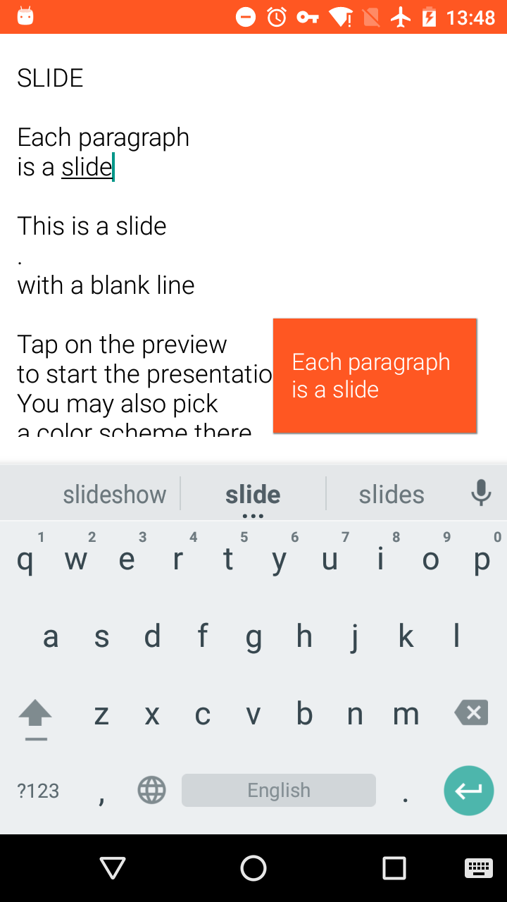
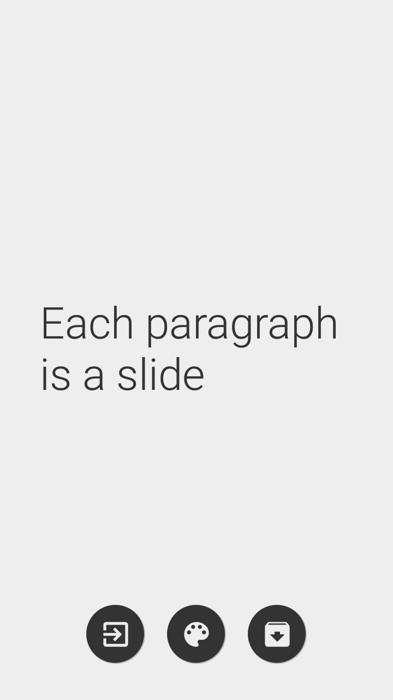

# Slide

<div>

<p>Minimal presentation tool for Android, perfect for using <a href="https://en.wikipedia.org/wiki/Takahashi_method">Takahashi</a> method.
Unlike a typical presentation, only a few words are printed on each slide using very large characters. To make up for this, a presenter will use many more slides than in a traditional presentation, each slide being shown for a much shorter duration.
</p>
</div>

<br/>

The slides use plain text in a visual manner, to help the audience quickly read and understand the material. It's said to be helpful with Japanese and other eastern languages which use non-Latin alphabets.

Many presenters in developer conferences use their own variant on Takahashi. 

The method is designed for the people who are not good at presentations and who are quite nervous about the idea of presenting. This method helps the presenter to get organized during the talk and keeps the presenter on track while presenting. The method provides clear visual support for the audience and helps make the content more memorable.




## Syntax

- [x] Each paragraph is a slide. Blank lines separate slides
- [x] Text is rendered using the largest possible font size to fit the slide bounds
- [x] Single-line text is centered, otherwise it's left-aligned
- [x] Text surrounded with asterisks is rendered as bold (emphasized). Use `**` to render a normal asterisk sign
- [x] Line starting with hash sign is a header
- [x] Line starting with two spaces are rendered as code (monospace).
- [x] Line starging with "@" allow to insert images from the URL (web, dropbox, local device storage)
- [ ] Images may be scaled, e.g `@http://example.com/bg.png 30%`
- [ ] Images may have certain gravity, e.g. `@http://example.com/logo.png top`
- [x] Dot at the beginning of a line is ignored. It's helpful to "escape" blank lines or special symbols inside a slide.

```
This is
a slide

# Header
@http://example.com/logo.png 20% left top
.
This is *another* slide

Code:
  int main() {
    return 0;
  }
```

Using:

* [Jedux](https://github.com/trikita/jedux) for Redux architecture
* [Anvil](https://github.com/zserge/anvil) for reactive views
* [Immutables](http://immutables.github.io) for immutable Redux state
* Material Icons TTF font
* Standard Andorid API to render PDF slides
