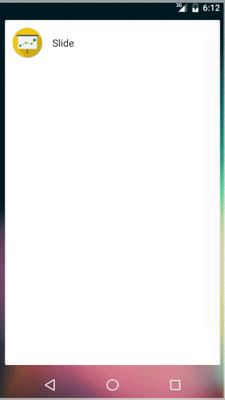

# Slide

[](https://travis-ci.org/trikita/slide)

<div>

<p>A pure and simple presentation tool for Android inspired by <a href="https://en.wikipedia.org/wiki/Takahashi_method">Takahashi</a> method.
With simple markup language you can easily make modern-looking text slides. The main idea of such a technique is to visualize speech keynote with no distracting details. Slides with only a few words shown can easily keep the audience aware of the speaker's point.
</p>
</div>

<br/>

It is also said to be extremely helpful with Japanese and other eastern languages which use non-Latin alphabets.

## Demo



View the demo presentation on [SlideShare](http://www.slideshare.net/SergeZaitsev/trikita-slide-pdf-example)

## Download

* [F-Droid](https://f-droid.org/repository/browse/?fdid=trikita.slide)
* [Google Play](https://play.google.com/store/apps/details?id=trikita.slide)

## Syntax

**General**

- Each paragraph is a slide. Blank lines separate slides
- Text is rendered using the largest possible font size to fit in the slide bounds
- Single-line text is centered, otherwise it's left-aligned
- Dot at the beginning of a line is ignored. It's helpful to "escape" blank lines or special symbols inside a slide

**Text style**

- Text surrounded with `*` is rendered as bold (emphasized). Use `**` to render a normal `*` sign
- Line starting with `#` is a header
- Line starting with `␣␣` (two spaces) is rendered as code (monospace).

**Images**

- Line starting with `@` inserts an image from the URL (web, dropbox, local device storage)
- Images may be scaled, e.g `@http://example.com/bg.png 30%`
- Images may have certain gravity, e.g. `@http://example.com/logo.png top`

## Usage

Get a full understanding of Slide syntax in the following presentation markup:

```
#SLIDE
perfect for keeping
your audience focused

text is *ALL* you've got
text is brief and clear

simple markup syntax

• big font size
• laconic messages
• many slides

@http://www.magic4walls.com/wp-content/uploads/2015/10/two-lines-between-black-and-white-circles-minimalism-wallpaper.jpg 140% top
minimal graphics

Code:
.
  int main() {
    return 0;
  }

#Slide is open-source
.
https://github.com/trikita/slide

#Feedback
#appreciated!  
```

Check out the presentation on [SlideShare](http://www.slideshare.net/SergeZaitsev/trikita-slide-app-demo)

## Dependencies

* [Jedux](https://github.com/trikita/jedux) for Redux architecture
* [Anvil](https://github.com/zserge/anvil) for reactive views
* [Immutables](http://immutables.github.io) for immutable Redux state
* Material Icons TTF font
* Standard Android API to render PDF slides

## Slide & HTML

There is also a compatible standalone HTML version of Slide. You can make a presentation in a text editor using not only Slide markup but the power of CSS as well. Find out more on the project [Github](https://github.com/trikita/slide-html).

## License

Code is distributed under MIT license, feel free to use it in your proprietary projects as well.
